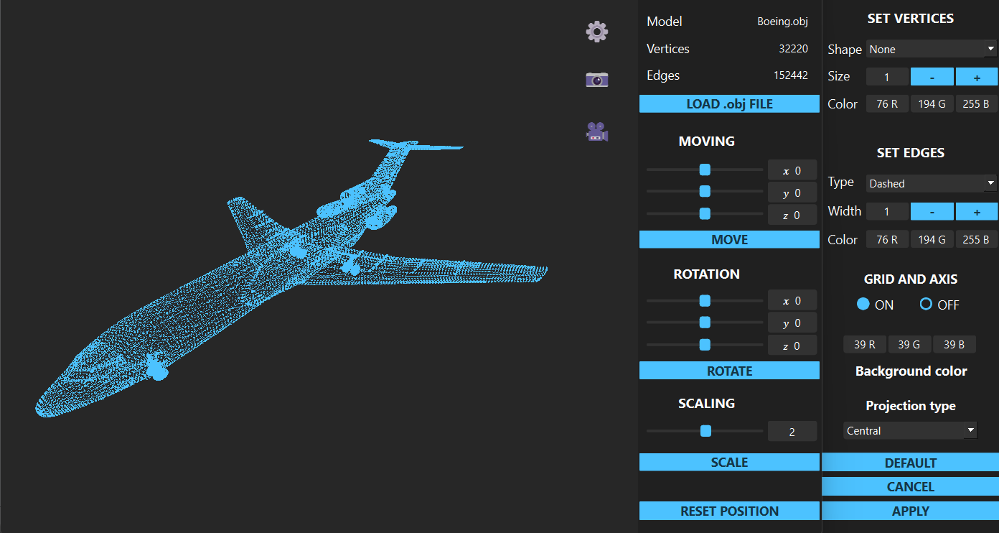
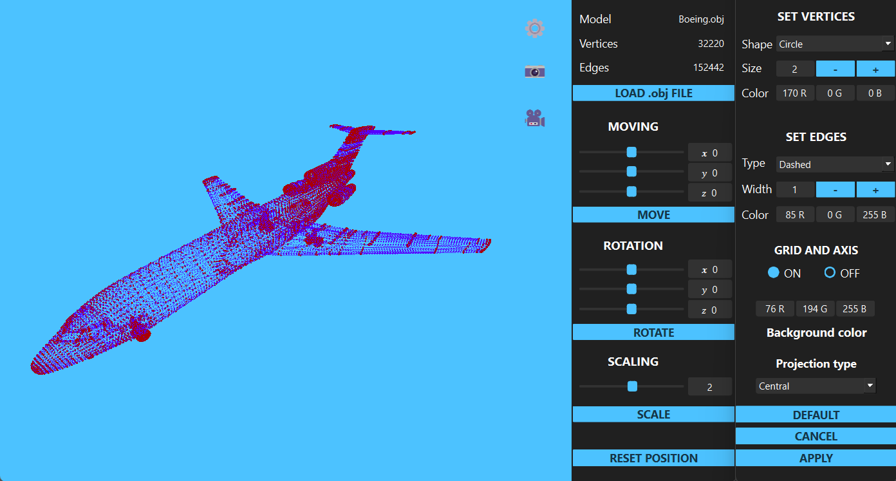

# 3DViewer v2.0
The 3DViewer v2.0 is a modern app written C++. The application provides viewing 3D wireframe models, loaded from .obj files and be viewable on the screen with the ability to rotate, scale and translate.

## Features
- Load a wireframe model from an obj file.
- Translate the model by a given distance in relation to the X, Y, Z axes.

  

- Rotate the model by a given angle relative to its X, Y, Z axes.
- Scale the model by a given value.

  

- Customizing the type of projection (parallel and central).
- Setting up the type (solid, dashed), color and thickness of the edges, display method (none, circle, square), color and size of the vertices.
- Choosing the background color.

  

- Saving settings between program restarts.

  

- Display grid and axes.

  

- Saving the captured (rendered) images as bmp and jpeg files.
- Recording small screencasts by a special button - the current custom affine transformation of the loaded object into gif-animation.

## License
Copyright (c). All rights reserved.